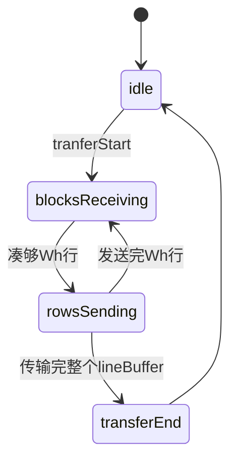

```mermaid
stateDiagram-v2
[*]-->idle
idle-->blocksReceiving: tranferStart
blocksReceiving-->rowsSending: 凑够Wh行
rowsSending-->blocksReceiving: 发送完Wh行
rowsSending-->transferEnd: 传输完整个lineBuffer
transferEnd--> idle

```